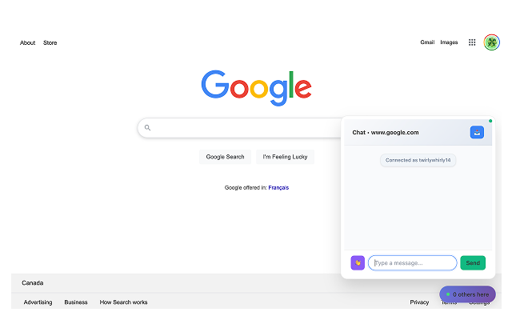
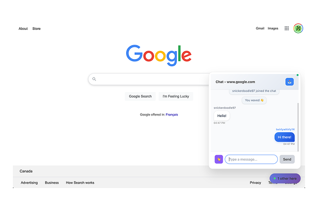

# OHey


A Chrome extension that allows users to chat with others viewing the same webpage in real-time.

## screenshots

<br/>


## Download Extension

> Extension is under review for Chrome Web Store.


Download the extension: [ohey-extension.zip](https://github.com/probablyangg/ohey/releases/tag/v0.1.0)

**Installation Instructions:**
1. Download and extract the zip file
2. Go to `chrome://extensions/` in your browser
3. Toggle "Developer mode" switch in the top-right corner
4. Click "Load unpacked" button
5. Select the extracted extension folder
6. The OHey extension will appear in your extensions list

## setup

```bash
# Navigate to server directory
cd server

# Install dependencies (ignore deprecation warnings - they're harmless)
npm install

# Start the development server
npm run dev
```

### chrome extension
- Go to `chrome://extensions/` in your browser
- Or: Chrome Menu → More Tools → Extensions
- Toggle "Developer mode" switch in the top-right corner
- Click "Load unpacked" button
- Navigate to and select the `extension` folder from this project
- The OHey extension will appear in your extensions list

-  **Reload the Extension** (if you had a previous version)
   - Click the refresh icon on the OHey extension
   - This ensures all updates load properly


### test

- Try `example.com`, `github.com`, or any site
- Look for the **floating chat indicator** in the bottom-right corner
- It shows "0 others here" initially
- Click the chat indicator to open the panel
- You'll see "Connected as [YourUsername]" (like "jigglybean86")
- Type a message and hit Enter!
- Open the **same website in another tab/window**
- Notice the user count updates to "1 other here"
- Chat between the tabs - messages appear instantly!
- Try the **wave button** 👋 to send waves
- Watch users join/leave in real-time
